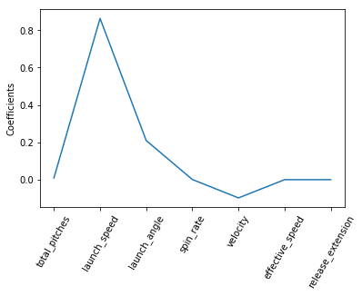

# Linear Regression Analysis on Statcast Data with scikit-learn

## By Christopher Hauman
<br>

### This will quickly run through using scikit-learn to perform regression analysis on [Statcast](https://blogs.umass.edu/Techbytes/2017/12/15/what-is-statcast/) data. The specific dataset was created in one of my other projects, [Cleaning MLB Statcast Data using pandas DataFrames and seaborn Visualization](https://nbviewer.jupyter.org/github/chrisman1015/Cleaning-Statcast-Data/blob/master/Cleaning%20Statcast%20Data/Cleaning%20Statcast%20Data.ipynb). 

### If you have any questions about the data please feel free to email me at christopherhauman@gmail.com. If you're unfamiliar with the basics of supervised learning, you should start with my guide on [KNN Classification on the Iris Dataset with scikit-learn](https://github.com/chrisman1015/Supervised-Learning/blob/master/KNN%20Classification%20on%20the%20Iris%20Dataset%20with%20scikit-learn/Iris.ipynb).
<br>


```python
# import pandas and matplotlib libraries
import pandas as pd
import matplotlib.pyplot as plt
import numpy as np

# there are a few depreciation and futurewarnings that could arise. We'll simply disable them for this guide

import warnings
from sklearn.exceptions import DataConversionWarning
warnings.filterwarnings('ignore')
warnings.filterwarnings(action='ignore',category=DeprecationWarning)

# import csv file to df_raw DataFrame
df = pd.read_csv("cleaned_allhr2018.csv", index_col=0)
```


```python
df.head()
```


<div>
<style scoped>
    .dataframe tbody tr th:only-of-type {
        vertical-align: middle;
    }

    .dataframe tbody tr th {
        vertical-align: top;
    }

    .dataframe thead th {
        text-align: right;
    }
</style>
<table border="1" class="dataframe">
  <thead>
    <tr style="text-align: right;">
      <th></th>
      <th>home_runs</th>
      <th>player_name</th>
      <th>total_pitches</th>
      <th>pitch_percent</th>
      <th>xwoba</th>
      <th>xba</th>
      <th>launch_speed</th>
      <th>launch_angle</th>
      <th>spin_rate</th>
      <th>velocity</th>
      <th>effective_speed</th>
      <th>release_extension</th>
    </tr>
  </thead>
  <tbody>
    <tr>
      <th>0</th>
      <td>48</td>
      <td>Khris Davis</td>
      <td>2514</td>
      <td>1.9</td>
      <td>1.671</td>
      <td>0.861</td>
      <td>105.9</td>
      <td>27.3</td>
      <td>2269.0</td>
      <td>89.6</td>
      <td>89.01</td>
      <td>5.93</td>
    </tr>
    <tr>
      <th>1</th>
      <td>43</td>
      <td>J.D. Martinez</td>
      <td>2519</td>
      <td>1.7</td>
      <td>1.537</td>
      <td>0.792</td>
      <td>105.0</td>
      <td>28.2</td>
      <td>2118.0</td>
      <td>88.8</td>
      <td>88.46</td>
      <td>6.05</td>
    </tr>
    <tr>
      <th>2</th>
      <td>40</td>
      <td>Joey Gallo</td>
      <td>2348</td>
      <td>1.7</td>
      <td>1.588</td>
      <td>0.806</td>
      <td>107.7</td>
      <td>29.4</td>
      <td>2164.0</td>
      <td>88.6</td>
      <td>88.14</td>
      <td>5.96</td>
    </tr>
    <tr>
      <th>3</th>
      <td>39</td>
      <td>Jose Ramirez</td>
      <td>3002</td>
      <td>1.3</td>
      <td>1.152</td>
      <td>0.620</td>
      <td>101.3</td>
      <td>28.8</td>
      <td>2192.0</td>
      <td>91.6</td>
      <td>91.37</td>
      <td>6.09</td>
    </tr>
    <tr>
      <th>4</th>
      <td>39</td>
      <td>Mike Trout</td>
      <td>2543</td>
      <td>1.5</td>
      <td>1.543</td>
      <td>0.809</td>
      <td>106.5</td>
      <td>28.0</td>
      <td>2203.0</td>
      <td>87.8</td>
      <td>87.11</td>
      <td>5.90</td>
    </tr>
  </tbody>
</table>
</div>


### Linear Regression


```python
from sklearn import linear_model
from sklearn.model_selection import train_test_split
from sklearn.metrics import mean_squared_error
```


```python
df_2 = df.drop(['home_runs', 'player_name', "pitch_percent", "xba", "xwoba"], axis=1)
```


```python
X = np.array(df_2.copy())
y = np.array(df['home_runs'])
df_2.head()
```


<div>
<style scoped>
    .dataframe tbody tr th:only-of-type {
        vertical-align: middle;
    }

    .dataframe tbody tr th {
        vertical-align: top;
    }

    .dataframe thead th {
        text-align: right;
    }
</style>
<table border="1" class="dataframe">
  <thead>
    <tr style="text-align: right;">
      <th></th>
      <th>total_pitches</th>
      <th>launch_speed</th>
      <th>launch_angle</th>
      <th>spin_rate</th>
      <th>velocity</th>
      <th>effective_speed</th>
      <th>release_extension</th>
    </tr>
  </thead>
  <tbody>
    <tr>
      <th>0</th>
      <td>2514</td>
      <td>105.9</td>
      <td>27.3</td>
      <td>2269.0</td>
      <td>89.6</td>
      <td>89.01</td>
      <td>5.93</td>
    </tr>
    <tr>
      <th>1</th>
      <td>2519</td>
      <td>105.0</td>
      <td>28.2</td>
      <td>2118.0</td>
      <td>88.8</td>
      <td>88.46</td>
      <td>6.05</td>
    </tr>
    <tr>
      <th>2</th>
      <td>2348</td>
      <td>107.7</td>
      <td>29.4</td>
      <td>2164.0</td>
      <td>88.6</td>
      <td>88.14</td>
      <td>5.96</td>
    </tr>
    <tr>
      <th>3</th>
      <td>3002</td>
      <td>101.3</td>
      <td>28.8</td>
      <td>2192.0</td>
      <td>91.6</td>
      <td>91.37</td>
      <td>6.09</td>
    </tr>
    <tr>
      <th>4</th>
      <td>2543</td>
      <td>106.5</td>
      <td>28.0</td>
      <td>2203.0</td>
      <td>87.8</td>
      <td>87.11</td>
      <td>5.90</td>
    </tr>
  </tbody>
</table>
</div>


```python
from sklearn.preprocessing import StandardScaler
from sklearn.preprocessing import Normalizer
from sklearn.pipeline import make_pipeline
```


```python
X_train, X_test, y_train, y_test = train_test_split(X, y, test_size = 0.25, random_state=1)

reg_all = linear_model.LinearRegression()

reg_all.fit(X_train, y_train)


y_pred = reg_all.predict(X_test)
```


```python
# get r^2 value
reg_all.score(X_test, y_test)
```


    0.7015125603184715


Perform Cross Validation:


```python
from sklearn.model_selection import cross_validate
from sklearn.linear_model import LinearRegression
```


```python
reg = LinearRegression()

cv_results = cross_val_score(reg, X, y, scoring='r2', cv=5)

print(cv_results)
np.mean(cv_results)
print("Average 5-Fold CV Score: {}".format(np.mean(cv_results)))
```

    [ -3.34568022  -4.29535959  -8.30258222 -21.39664084 -84.35267439]
    Average 5-Fold CV Score: -24.338587450752847
    

### Ridge Regression:


```python
from sklearn.linear_model import Ridge

ridge = Ridge(alpha=0.1, normalize=True)

ridge.fit(X_train, y_train)

ridge.pred = ridge.predict(X_test)

ridge.score(X_test, y_test)
```


    0.6982513906079996


### Lasso Regression


```python
from sklearn.linear_model import Lasso

lasso = Lasso(alpha=0.1, normalize=True)

lasso.fit(X_train, y_train)

lasso_pred = lasso.predict(X_test)

lasso.score(X_test, y_test)
```


    0.6227431933287793


```python
names = df_2.columns

lasso = Lasso(alpha=0.1)

lasso_coef = lasso.fit(X, y).coef_

plt.plot(range(len(names)), lasso_coef)
plt.xticks(range(len(names)), names, rotation=60)
plt.ylabel('Coefficients')
plt.show()
```





Unsurprisingly, launch speed and launch angle are the two variables most highly correlated with home runs.
<br>

Let's get rid of the other variables and see how well Lasso Regression performs with cross-validation:


```python
launch = np.array(df.loc[:, ['launch_angle', 'launch_speed']])
```


```python
X_train, X_test, y_train, y_test = train_test_split(launch, y, test_size = 0.25, random_state=1)

from sklearn.model_selection import GridSearchCV

param_grid2 = {'alpha':[0.1, 0.3, 0.5, 0.7, 0.9]}

lasso = Lasso(normalize=True)
# Instantiate the GridSearchCV object: logreg_cv
lasso_cv = GridSearchCV(lasso, param_grid2, cv=10)

lasso_cv.fit(X_train, y_train)

print("Tuned Lasso Regression Parameter: {}".format(lasso_cv.best_params_))
print("Tuned Lasso Regression r^2: {}".format(lasso_cv.best_score_))
```

    Tuned Lasso Regression Parameter: {'alpha': 0.1}
    Tuned Lasso Regression r^2: -0.06162974929081208
    


```python
lasso_cv.score(X_test, y_test)
```


    0.0011503163814267081


We see none of the linear models came even close to predicting the home_run value based on the other features. This implies a linear model is a very poor model for this data.
