# NMF Decomposition on LCD Digits Data with scikit-learn

## By Christopher Hauman
<br>

### This example of NMF Decomposition was adapted from DataCamp's [Unsupervised Learning in Python](https://www.datacamp.com/courses/unsupervised-learning-in-python) course. If you're not familiar with unsupervised learning, you can find an introduction in my guide on [K-Means Classification on the Iris Dataset with scikit-learn](https://nbviewer.jupyter.org/github/chrisman1015/Unsupervised-Learning/blob/master/K-Means%20Classification%20on%20the%20Iris%20Dataset%20with%20scikit-learn/K-Means%20Classification%20on%20the%20Iris%20Dataset%20with%20scikit-learn.ipynb).

### Note: This assumes you have basic knowledge of python data science basics. If you don't, or encounter something you're not familiar with, don't worry! You can get a crash course in my guide, [Cleaning MLB Statcast Data using pandas DataFrames and seaborn Visualization](https://nbviewer.jupyter.org/github/chrisman1015/Cleaning-Statcast-Data/blob/master/Cleaning%20Statcast%20Data/Cleaning%20Statcast%20Data.ipynb).
<br>

First, we'll import our libraries and import the lcd-digits data. You can take a peek at the attached csv file to see what it looks like raw. Each row corresponds to a grayscale digit image where the values are 0 for white and 1 for black. In other grayscale images you'll see a gradient of values between 0 and 1 for different shades of gray, but these consist of only black and white.


```python
import pandas as pd
import numpy as np
from matplotlib import pyplot as plt

# import data
df = pd.read_csv('lcd-digits.csv')
df.head()

#convert data to numPy array for processing
samples = np.array(df)
```

We'll quickly demonstrate the digits by looking at the first row (index 0) of the samples data.


```python
# Select the 0th row: digit
digit = samples[0,:]

# Print digit
print(digit)
```

    [0. 0. 0. 0. 0. 0. 0. 0. 0. 0. 1. 1. 1. 1. 0. 0. 0. 1. 0. 0. 0. 0. 1. 0.
     0. 1. 0. 0. 0. 0. 1. 0. 0. 1. 0. 0. 0. 0. 1. 0. 0. 1. 0. 0. 0. 0. 1. 0.
     0. 0. 1. 1. 1. 1. 0. 0. 0. 0. 0. 0. 0. 0. 0. 0. 0. 0. 0. 0. 0. 0. 0. 0.
     0. 0. 0. 0. 0. 0. 0. 0. 0. 0. 0. 0. 0. 0. 0. 0. 0. 0. 0. 0. 0. 0. 0. 0.
     0. 0. 0. 0. 0. 0. 0. 0.]
    

Now we'll reshape the array using **reshape** to it's intended shape, 13 rows by 8 columns


```python
samples.shape
```


    (99, 104)


```python
# Reshape digit to a 13x8 array: bitmap
bitmap = digit.reshape(13,8)

# Print bitmap
print(bitmap)
```

    [[0. 0. 0. 0. 0. 0. 0. 0.]
     [0. 0. 1. 1. 1. 1. 0. 0.]
     [0. 1. 0. 0. 0. 0. 1. 0.]
     [0. 1. 0. 0. 0. 0. 1. 0.]
     [0. 1. 0. 0. 0. 0. 1. 0.]
     [0. 1. 0. 0. 0. 0. 1. 0.]
     [0. 0. 1. 1. 1. 1. 0. 0.]
     [0. 0. 0. 0. 0. 0. 0. 0.]
     [0. 0. 0. 0. 0. 0. 0. 0.]
     [0. 0. 0. 0. 0. 0. 0. 0.]
     [0. 0. 0. 0. 0. 0. 0. 0.]
     [0. 0. 0. 0. 0. 0. 0. 0.]
     [0. 0. 0. 0. 0. 0. 0. 0.]]
    

Finally, we'll use pyplot's **imshow** to show what the image looks like:


```python
# Use plt.imshow to display bitmap
plt.imshow(bitmap, cmap='gray', interpolation='nearest')
plt.colorbar()
plt.show()
```


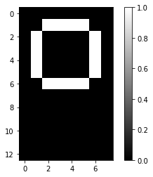


Let's quickly create a function which will perfom this resampling and display the image for any row:


```python
def show_as_image(sample):
    bitmap = sample.reshape((13, 8))
    plt.figure()
    plt.imshow(bitmap, cmap='gray', interpolation='nearest')
    plt.colorbar()
    plt.show()
```

To demonstrate, we'll have it display the last image:


```python
show_as_image(samples[-1,:])
```


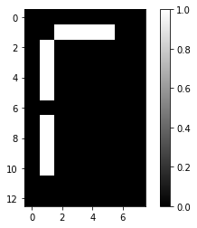


Now it's time to demonstrate the beauty of NMF for image decomposition. We'll import and fit the model to the sample data:


```python
# Import NMF
from sklearn.decomposition import NMF

# Create an NMF model: model
model = NMF(n_components=7)

# Apply fit_transform to samples: features
features = model.fit_transform(samples)
```

Now that we've fit the model to the samples, we can use the **.components-** attribute of an NMF model, which contains parts of images in this case.


```python
# Call show_as_image on each component
for component in model.components_:
    show_as_image(component)
```


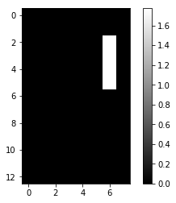


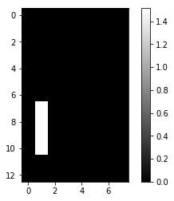


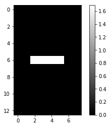


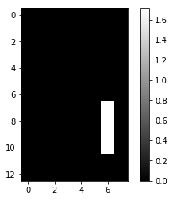


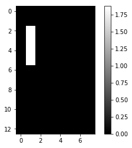


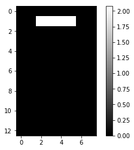


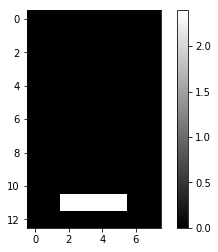


Amazingly, the NMF model was able to correctly extract the individual parts which can be used to make any LCD image.
<br>

Let's quickly output the first row of the features array which was the result of fitting the model:


```python
# Assign the 0th row of features: digit_features
digit_features = features[0,:]

# Print digit_features
print(digit_features)
```

    [0.56389272 0.         0.59151401 0.         0.53290007 0.48133215
     0.        ]
    

Though these numbers may look like nonsense, they contain specific data which related the components back to the original values. We can use matrix multiplication with the features and components to approximately reconstruct the original samples.


```python
reconstructed = np.matmul(features, model.components_)

# print the first 20 values of the first row of the reconstructed data
reconstructed[0,:]
```


    array([0.00000000e+00, 0.00000000e+00, 0.00000000e+00, 0.00000000e+00,
           0.00000000e+00, 0.00000000e+00, 0.00000000e+00, 0.00000000e+00,
           0.00000000e+00, 0.00000000e+00, 9.99999674e-01, 9.99999674e-01,
           9.99999674e-01, 9.99999674e-01, 0.00000000e+00, 0.00000000e+00,
           0.00000000e+00, 9.99999784e-01, 0.00000000e+00, 0.00000000e+00,
           0.00000000e+00, 0.00000000e+00, 9.99943174e-01, 0.00000000e+00,
           0.00000000e+00, 9.99999784e-01, 0.00000000e+00, 0.00000000e+00,
           0.00000000e+00, 0.00000000e+00, 9.99943174e-01, 0.00000000e+00,
           0.00000000e+00, 9.99999784e-01, 0.00000000e+00, 0.00000000e+00,
           0.00000000e+00, 0.00000000e+00, 9.99943174e-01, 0.00000000e+00,
           0.00000000e+00, 9.99999784e-01, 0.00000000e+00, 0.00000000e+00,
           0.00000000e+00, 0.00000000e+00, 9.99943174e-01, 0.00000000e+00,
           0.00000000e+00, 0.00000000e+00, 1.00000000e+00, 1.00000000e+00,
           1.00000000e+00, 1.00000000e+00, 0.00000000e+00, 0.00000000e+00,
           0.00000000e+00, 0.00000000e+00, 0.00000000e+00, 0.00000000e+00,
           0.00000000e+00, 0.00000000e+00, 0.00000000e+00, 0.00000000e+00,
           0.00000000e+00, 0.00000000e+00, 0.00000000e+00, 0.00000000e+00,
           0.00000000e+00, 0.00000000e+00, 0.00000000e+00, 0.00000000e+00,
           0.00000000e+00, 0.00000000e+00, 0.00000000e+00, 0.00000000e+00,
           0.00000000e+00, 0.00000000e+00, 0.00000000e+00, 0.00000000e+00,
           0.00000000e+00, 0.00000000e+00, 0.00000000e+00, 0.00000000e+00,
           0.00000000e+00, 0.00000000e+00, 0.00000000e+00, 0.00000000e+00,
           0.00000000e+00, 0.00000000e+00, 2.52458877e-05, 2.52458877e-05,
           2.52458877e-05, 2.52458877e-05, 0.00000000e+00, 0.00000000e+00,
           0.00000000e+00, 0.00000000e+00, 0.00000000e+00, 0.00000000e+00,
           0.00000000e+00, 0.00000000e+00, 0.00000000e+00, 0.00000000e+00])


We see that none of the values are in the same format as the original samples, so we'll round them all to one decimal place:


```python
# round the reconstructed data to one decimal place
rounded = np.around(reconstructed, decimals=1)

# print the first value
rounded[0,0]
```


    0.0


Finally, we can use **array_equal** to see if the reconstructed array is the exact same as the original samples:


```python
np.array_equal(rounded, samples)
```


    True


There you have it! We can now perform NMF deconstruction and reconstruction with sklearn.
***

As an extra illustration, I'll demonstrate the challenge of choosing the correct number of components when performing the decomposition. I'll display what the components look like for different n_components values with a function I wrote, which you can read more about [here](https://nbviewer.jupyter.org/github/chrisman1015/Unsupervised-Learning/blob/master/NMF%20Image%20Decomposer/NMF%20Image%20Decomposer.ipynb).


```python
# samples holds the samples you want to model
# shape is the shape of the plot
# list_num_components takes a list of the numbers of components you want considered

def nmf_image_decomposer(samples, shape, list_num_components):    
    
    # make sure samples input is in correct shape. If not, reshape it
    if samples.ndim > 2:
        samples = samples.reshape(samples.shape[0], (samples.shape[1]*samples.shape[2]))
    
    # write a function to show the image in the loop
    def show_as_image_inloop(samples):
        
        #reshape the image to the shape you want
        bitmap = samples.reshape(shape)
        plt.imshow(bitmap, cmap='gray', interpolation='nearest')
        plt.colorbar()
    
    # now iterate through the number of components
    for i in list_num_components:
        
        
        # Create an NMF model with i components
        model = NMF(n_components=i)
        
        # Apply fit_transform to samples: features
        features = model.fit_transform(samples)
    
        
        ############
        ## GET READY TO PLOT

        # print number of components for plot
        print("Plots for n_components =", i)
    
    
        # if only 1 component, plot it
        if i < 2:
            show_as_image(model.components_[i-1])
            print("\n")
            
       
        # iterate through the components and plot them
        elif i < 4:
            plt.figure(figsize=(5*i, 5))
            for j in range(i):
                plt.subplot(1,i,j+1)
                show_as_image_inloop(model.components_[j])
                plt.title("index " + str(j))
            plt.show()
            plt.close()
            print("\n")
        
        # if more than 4 components, plot four random components
        else:
            import random
            # sample 4 random indexes in range(i)
            sample = random.sample(range(i), 4)
            
            plt.figure(figsize=(20, 5))
            for j in range(4):
                plt.subplot(1,4,j+1)
                
                # iterate through and plot the indexes taken ranomly
                show_as_image_inloop(model.components_[sample[j]])
                plt.title("index " + str(sample[j]))
            plt.show()
            print("\n")
    
    return()
```


```python
shape = (13,8)
list1 = [1,3,7,8,13]
```

We'll display the components for n_components = 1, 3, 7, 11, and 37:


```python
nmf_image_decomposer(samples, shape, list1)
```

    Plots for n_components = 1
    


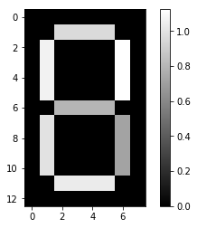


    
    
    Plots for n_components = 3
    


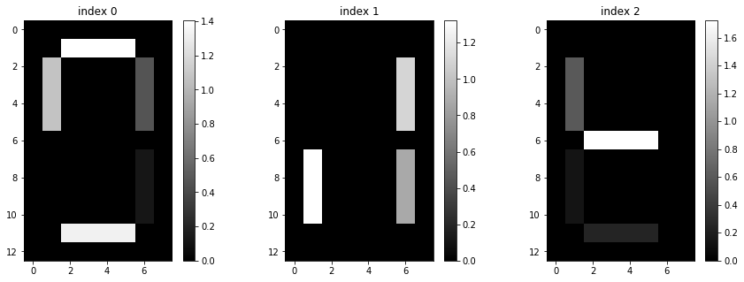


    
    
    Plots for n_components = 7
    


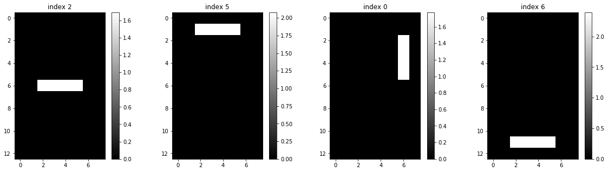


    
    
    Plots for n_components = 8
    


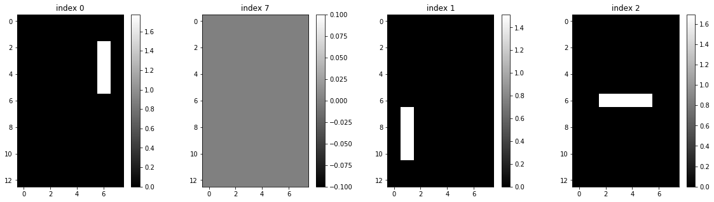


    
    
    Plots for n_components = 13
    


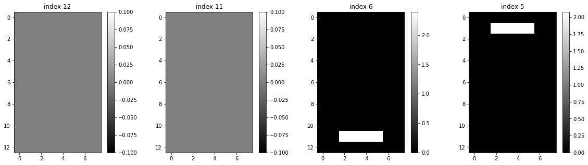


    
    
    


    ()


We see that n_components=1 yields a single component which can represent all the images. 
<br>

At n_components=3, the NMF model can begin to differentiate between the different components of LCD digit.
<br>

n_components=7 yields our original model which displays the seven true components which make up any LCD digit.
<br>

At n_components=8 and beyond, we begin to see empty plots. This is because seven is the maximum true number of componenets the model can break the images down to, so it simply creates empty components after 7.
<br>
<br>
This should hopefully demonstrate the necessity of choosing the correct number of components. When n_components is too small, the model can't actually decompose the data enough to get usefull information. Too large, and the model may run out of compoents it can actually find.
