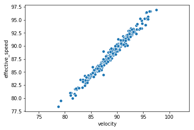
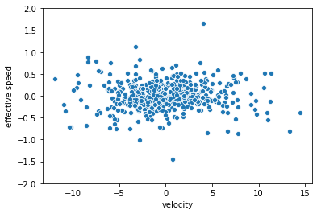
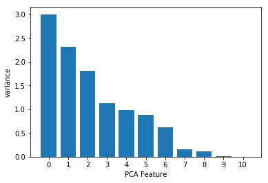

# Principal Component Analysis on the Statcast Homeruns Data

## By Christopher Hauman
<br>

#### This example is the sequel to my guide on [Principal Component Analysis on the Iris Dataset](https://nbviewer.jupyter.org/github/chrisman1015/Unsupervised-Learning/blob/master/PCA%20on%20the%20Iris%20Dataset%20with%20scikit-learn/Principal%20Component%20Analysis.ipynb). You can read more about PCA and see some great visuals [here](http://setosa.io/ev/principal-component-analysis/).

#### Note: This assumes you have basic knowledge of python data science basics. If you don't, or encounter something you're not familiar with, don't worry! You can get a crash course in my guide, [Cleaning MLB Statcast Data using pandas DataFrames and seaborn Visualization](https://nbviewer.jupyter.org/github/chrisman1015/Cleaning-Statcast-Data/blob/master/Cleaning%20Statcast%20Data/Cleaning%20Statcast%20Data.ipynb).
<br>


```python
from sklearn.decomposition import PCA
from scipy.stats import pearsonr
```


```python
# pandas and numPy for DataFrames and arrays
import pandas as pd
import numpy as np

# pyplot and seaborn for plots
import matplotlib.pyplot as plt
import seaborn as sns
```


```python
# import csv file to df_raw DataFrame
df_hr = pd.read_csv("cleaned_allhr2018.csv", index_col=0)
df2 = df_hr.copy()
df_hr.head()
```


<div>
<style scoped>
    .dataframe tbody tr th:only-of-type {
        vertical-align: middle;
    }

    .dataframe tbody tr th {
        vertical-align: top;
    }

    .dataframe thead th {
        text-align: right;
    }
</style>
<table border="1" class="dataframe">
  <thead>
    <tr style="text-align: right;">
      <th></th>
      <th>home_runs</th>
      <th>player_name</th>
      <th>total_pitches</th>
      <th>pitch_percent</th>
      <th>xwoba</th>
      <th>xba</th>
      <th>launch_speed</th>
      <th>launch_angle</th>
      <th>spin_rate</th>
      <th>velocity</th>
      <th>effective_speed</th>
      <th>release_extension</th>
    </tr>
  </thead>
  <tbody>
    <tr>
      <th>0</th>
      <td>48</td>
      <td>Khris Davis</td>
      <td>2514</td>
      <td>1.9</td>
      <td>1.671</td>
      <td>0.861</td>
      <td>105.9</td>
      <td>27.3</td>
      <td>2269.0</td>
      <td>89.6</td>
      <td>89.01</td>
      <td>5.93</td>
    </tr>
    <tr>
      <th>1</th>
      <td>43</td>
      <td>J.D. Martinez</td>
      <td>2519</td>
      <td>1.7</td>
      <td>1.537</td>
      <td>0.792</td>
      <td>105.0</td>
      <td>28.2</td>
      <td>2118.0</td>
      <td>88.8</td>
      <td>88.46</td>
      <td>6.05</td>
    </tr>
    <tr>
      <th>2</th>
      <td>40</td>
      <td>Joey Gallo</td>
      <td>2348</td>
      <td>1.7</td>
      <td>1.588</td>
      <td>0.806</td>
      <td>107.7</td>
      <td>29.4</td>
      <td>2164.0</td>
      <td>88.6</td>
      <td>88.14</td>
      <td>5.96</td>
    </tr>
    <tr>
      <th>3</th>
      <td>39</td>
      <td>Jose Ramirez</td>
      <td>3002</td>
      <td>1.3</td>
      <td>1.152</td>
      <td>0.620</td>
      <td>101.3</td>
      <td>28.8</td>
      <td>2192.0</td>
      <td>91.6</td>
      <td>91.37</td>
      <td>6.09</td>
    </tr>
    <tr>
      <th>4</th>
      <td>39</td>
      <td>Mike Trout</td>
      <td>2543</td>
      <td>1.5</td>
      <td>1.543</td>
      <td>0.809</td>
      <td>106.5</td>
      <td>28.0</td>
      <td>2203.0</td>
      <td>87.8</td>
      <td>87.11</td>
      <td>5.90</td>
    </tr>
  </tbody>
</table>
</div>


```python
velo_df = df_hr[['velocity', 'effective_speed']]
```

Let's demonstrate the decorrelation of the data in PCA once more by looking at the velocity and effective speed of the pitches.


```python
# Scatter plot width vs length
sns.scatterplot('velocity','effective_speed', data=velo_df)
plt.axis('equal')
plt.show()

# Calculate the Pearson correlation
correlation, pvalue = pearsonr(velo_df['velocity'], velo_df['effective_speed'])

# Display the correlation
print('correlation =', correlation)
```





    correlation = 0.9882583385513954
    


```python
# build and fit PCA model to decorrelate data
model = PCA()
pca_features = model.fit_transform(np.array(velo_df))

# plot decorrelated data
df_transformed = pd.DataFrame(pca_features)
df_transformed.columns = ['x', 'y']
sns.scatterplot(x='x', y='y', data=df_transformed , palette="Set1")
plt.xlabel('velocity')
plt.ylabel('effective speed')
plt.ylim(-2,2)
plt.show()

# Calculate the Pearson correlation of xs and ys
correlation, pvalue = pearsonr(df_transformed['x'], df_transformed['y'])

# Display the correlation
print('correlation =', correlation)
```





    correlation = -5.6764174732599534e-18
    

We see the data now has a correlation ~ 0. 
<br>

We'll now perform this on the entire dataset and get the PCA features explained variance barplot.


```python
array_no_name = np.array(df_hr.drop('player_name', axis =1))

# fit pca model to the entire dataset
from sklearn.preprocessing import StandardScaler
from sklearn.pipeline import make_pipeline

# create and fit the model to the hrs data
scaler = StandardScaler()
pca = PCA()
pipeline = make_pipeline(scaler, pca)
pipeline.fit(array_no_name)
features = range(pca.n_components_)

# plot features vs variance
plt.bar(features, pca.explained_variance_)
plt.xticks(features)
plt.ylabel('variance')
plt.xlabel('PCA Feature')
plt.show()
```





We see the dropoff occurs between PCA feature 6 and 7. We'll now perform the PCA dimension reduction with n_components = 6.


```python
# Create a PCA model with 6 components: pca
pca = PCA(n_components=6)

# Fit the PCA instance to the scaled samples
pca.fit(array_no_name)

# Transform the scaled samples: pca_features
pca_features = pca.transform(array_no_name)

# Print the shape of pca_features
print(pca_features.shape)
```

    (508, 6)
    

We can store these dimension reduced arrays in their own dataframes, one with the player names and one without.


```python
hr_reduced = pd.DataFrame(pca_features)
hr_reduced.columns = ['a','b', 'c', 'd', 'e', 'f']
hr_reduced.head()
```


<div>
<style scoped>
    .dataframe tbody tr th:only-of-type {
        vertical-align: middle;
    }

    .dataframe tbody tr th {
        vertical-align: top;
    }

    .dataframe thead th {
        text-align: right;
    }
</style>
<table border="1" class="dataframe">
  <thead>
    <tr style="text-align: right;">
      <th></th>
      <th>a</th>
      <th>b</th>
      <th>c</th>
      <th>d</th>
      <th>e</th>
      <th>f</th>
    </tr>
  </thead>
  <tbody>
    <tr>
      <th>0</th>
      <td>1178.136198</td>
      <td>-57.000661</td>
      <td>25.950992</td>
      <td>-1.703247</td>
      <td>0.219834</td>
      <td>-2.739987</td>
    </tr>
    <tr>
      <th>1</th>
      <td>1182.891028</td>
      <td>94.011795</td>
      <td>20.963669</td>
      <td>-1.311405</td>
      <td>-0.695599</td>
      <td>-2.154081</td>
    </tr>
    <tr>
      <th>2</th>
      <td>1011.931914</td>
      <td>47.789403</td>
      <td>20.120658</td>
      <td>-0.784266</td>
      <td>-0.367282</td>
      <td>1.039358</td>
    </tr>
    <tr>
      <th>3</th>
      <td>1665.927117</td>
      <td>20.633629</td>
      <td>11.667128</td>
      <td>-4.701477</td>
      <td>-2.253194</td>
      <td>-3.919734</td>
    </tr>
    <tr>
      <th>4</th>
      <td>1206.964703</td>
      <td>9.055798</td>
      <td>17.097611</td>
      <td>0.750327</td>
      <td>0.680563</td>
      <td>-0.161116</td>
    </tr>
  </tbody>
</table>
</div>


```python
hr_6D = hr_reduced.copy()
hr_6D['player_name'] = df_hr['player_name']
hr_6D.head()
```


<div>
<style scoped>
    .dataframe tbody tr th:only-of-type {
        vertical-align: middle;
    }

    .dataframe tbody tr th {
        vertical-align: top;
    }

    .dataframe thead th {
        text-align: right;
    }
</style>
<table border="1" class="dataframe">
  <thead>
    <tr style="text-align: right;">
      <th></th>
      <th>a</th>
      <th>b</th>
      <th>c</th>
      <th>d</th>
      <th>e</th>
      <th>f</th>
      <th>player_name</th>
    </tr>
  </thead>
  <tbody>
    <tr>
      <th>0</th>
      <td>1178.136198</td>
      <td>-57.000661</td>
      <td>25.950992</td>
      <td>-1.703247</td>
      <td>0.219834</td>
      <td>-2.739987</td>
      <td>Khris Davis</td>
    </tr>
    <tr>
      <th>1</th>
      <td>1182.891028</td>
      <td>94.011795</td>
      <td>20.963669</td>
      <td>-1.311405</td>
      <td>-0.695599</td>
      <td>-2.154081</td>
      <td>J.D. Martinez</td>
    </tr>
    <tr>
      <th>2</th>
      <td>1011.931914</td>
      <td>47.789403</td>
      <td>20.120658</td>
      <td>-0.784266</td>
      <td>-0.367282</td>
      <td>1.039358</td>
      <td>Joey Gallo</td>
    </tr>
    <tr>
      <th>3</th>
      <td>1665.927117</td>
      <td>20.633629</td>
      <td>11.667128</td>
      <td>-4.701477</td>
      <td>-2.253194</td>
      <td>-3.919734</td>
      <td>Jose Ramirez</td>
    </tr>
    <tr>
      <th>4</th>
      <td>1206.964703</td>
      <td>9.055798</td>
      <td>17.097611</td>
      <td>0.750327</td>
      <td>0.680563</td>
      <td>-0.161116</td>
      <td>Mike Trout</td>
    </tr>
  </tbody>
</table>
</div>


