# t-SNE on the Statcast Homerun Data

## By Christopher Hauman
<br>

### This apply the t-SNE algorithm tothe Statcast Homeruns Data we cleaned in [Cleaning MLB Statcast Data using pandas DataFrames and seaborn Visualization](https://nbviewer.jupyter.org/github/chrisman1015/Cleaning-Statcast-Data/blob/master/Cleaning%20Statcast%20Data/Cleaning%20Statcast%20Data.ipynb). Let's see if we can pick out any patterns! 
<br>

If you're not familiar with the t-SNE algorithm, you can find an introduction in my guide on [t-SNE Classification on the Iris Dataset with scikit-learn](https://nbviewer.jupyter.org/github/chrisman1015/Unsupervised-Learning/blob/master/t-SNE%20on%20the%20Iris%20Dataset%20with%20scikit-learn/t-SNE%20classification%20on%20the%20Iris%20Dataset%20with%20scikit-learn.ipynb).


```python
# pandas and numPy for DataFrames and arrays
import pandas as pd
import numpy as np

# pyplot and seaborn for plots
import matplotlib.pyplot as plt
import seaborn as sns

from sklearn.manifold import TSNE
```

Import Statcast Homerun Data:


```python
# import csv file to df_raw DataFrame
df_hr = pd.read_csv("cleaned_allhr2018.csv", index_col=0)
df_hr.head()
```


<div>
<style scoped>
    .dataframe tbody tr th:only-of-type {
        vertical-align: middle;
    }

    .dataframe tbody tr th {
        vertical-align: top;
    }

    .dataframe thead th {
        text-align: right;
    }
</style>
<table border="1" class="dataframe">
  <thead>
    <tr style="text-align: right;">
      <th></th>
      <th>home_runs</th>
      <th>player_name</th>
      <th>total_pitches</th>
      <th>pitch_percent</th>
      <th>xwoba</th>
      <th>xba</th>
      <th>launch_speed</th>
      <th>launch_angle</th>
      <th>spin_rate</th>
      <th>velocity</th>
      <th>effective_speed</th>
      <th>release_extension</th>
    </tr>
  </thead>
  <tbody>
    <tr>
      <th>0</th>
      <td>48</td>
      <td>Khris Davis</td>
      <td>2514</td>
      <td>1.9</td>
      <td>1.671</td>
      <td>0.861</td>
      <td>105.9</td>
      <td>27.3</td>
      <td>2269.0</td>
      <td>89.6</td>
      <td>89.01</td>
      <td>5.93</td>
    </tr>
    <tr>
      <th>1</th>
      <td>43</td>
      <td>J.D. Martinez</td>
      <td>2519</td>
      <td>1.7</td>
      <td>1.537</td>
      <td>0.792</td>
      <td>105.0</td>
      <td>28.2</td>
      <td>2118.0</td>
      <td>88.8</td>
      <td>88.46</td>
      <td>6.05</td>
    </tr>
    <tr>
      <th>2</th>
      <td>40</td>
      <td>Joey Gallo</td>
      <td>2348</td>
      <td>1.7</td>
      <td>1.588</td>
      <td>0.806</td>
      <td>107.7</td>
      <td>29.4</td>
      <td>2164.0</td>
      <td>88.6</td>
      <td>88.14</td>
      <td>5.96</td>
    </tr>
    <tr>
      <th>3</th>
      <td>39</td>
      <td>Jose Ramirez</td>
      <td>3002</td>
      <td>1.3</td>
      <td>1.152</td>
      <td>0.620</td>
      <td>101.3</td>
      <td>28.8</td>
      <td>2192.0</td>
      <td>91.6</td>
      <td>91.37</td>
      <td>6.09</td>
    </tr>
    <tr>
      <th>4</th>
      <td>39</td>
      <td>Mike Trout</td>
      <td>2543</td>
      <td>1.5</td>
      <td>1.543</td>
      <td>0.809</td>
      <td>106.5</td>
      <td>28.0</td>
      <td>2203.0</td>
      <td>87.8</td>
      <td>87.11</td>
      <td>5.90</td>
    </tr>
  </tbody>
</table>
</div>


We'll get rid of the names, as we don't want any string variables to interfere with the model.


```python
df_no_name = df_hr.drop('player_name', axis=1)
df_no_name.head()
```


<div>
<style scoped>
    .dataframe tbody tr th:only-of-type {
        vertical-align: middle;
    }

    .dataframe tbody tr th {
        vertical-align: top;
    }

    .dataframe thead th {
        text-align: right;
    }
</style>
<table border="1" class="dataframe">
  <thead>
    <tr style="text-align: right;">
      <th></th>
      <th>home_runs</th>
      <th>total_pitches</th>
      <th>pitch_percent</th>
      <th>xwoba</th>
      <th>xba</th>
      <th>launch_speed</th>
      <th>launch_angle</th>
      <th>spin_rate</th>
      <th>velocity</th>
      <th>effective_speed</th>
      <th>release_extension</th>
    </tr>
  </thead>
  <tbody>
    <tr>
      <th>0</th>
      <td>48</td>
      <td>2514</td>
      <td>1.9</td>
      <td>1.671</td>
      <td>0.861</td>
      <td>105.9</td>
      <td>27.3</td>
      <td>2269.0</td>
      <td>89.6</td>
      <td>89.01</td>
      <td>5.93</td>
    </tr>
    <tr>
      <th>1</th>
      <td>43</td>
      <td>2519</td>
      <td>1.7</td>
      <td>1.537</td>
      <td>0.792</td>
      <td>105.0</td>
      <td>28.2</td>
      <td>2118.0</td>
      <td>88.8</td>
      <td>88.46</td>
      <td>6.05</td>
    </tr>
    <tr>
      <th>2</th>
      <td>40</td>
      <td>2348</td>
      <td>1.7</td>
      <td>1.588</td>
      <td>0.806</td>
      <td>107.7</td>
      <td>29.4</td>
      <td>2164.0</td>
      <td>88.6</td>
      <td>88.14</td>
      <td>5.96</td>
    </tr>
    <tr>
      <th>3</th>
      <td>39</td>
      <td>3002</td>
      <td>1.3</td>
      <td>1.152</td>
      <td>0.620</td>
      <td>101.3</td>
      <td>28.8</td>
      <td>2192.0</td>
      <td>91.6</td>
      <td>91.37</td>
      <td>6.09</td>
    </tr>
    <tr>
      <th>4</th>
      <td>39</td>
      <td>2543</td>
      <td>1.5</td>
      <td>1.543</td>
      <td>0.809</td>
      <td>106.5</td>
      <td>28.0</td>
      <td>2203.0</td>
      <td>87.8</td>
      <td>87.11</td>
      <td>5.90</td>
    </tr>
  </tbody>
</table>
</div>


```python
# turn hr data into numpy array
hr_array = np.array(df_no_name)

#intialize model
model_hr = TSNE(learning_rate=100, random_state=2)

# fit model to hr array
transformed_hr = model_hr.fit_transform(hr_array)
```

Now let's add those transformed values back into the original hr_df so we can plot them:


```python
df_transformed_hr = pd.DataFrame(transformed_hr)
df_transformed_hr.columns = ['x', 'y']
df_hr['x'] = df_transformed_hr['x']
df_hr['y'] = df_transformed_hr["y"]

df_hr.head()
```


<div>
<style scoped>
    .dataframe tbody tr th:only-of-type {
        vertical-align: middle;
    }

    .dataframe tbody tr th {
        vertical-align: top;
    }

    .dataframe thead th {
        text-align: right;
    }
</style>
<table border="1" class="dataframe">
  <thead>
    <tr style="text-align: right;">
      <th></th>
      <th>home_runs</th>
      <th>player_name</th>
      <th>total_pitches</th>
      <th>pitch_percent</th>
      <th>xwoba</th>
      <th>xba</th>
      <th>launch_speed</th>
      <th>launch_angle</th>
      <th>spin_rate</th>
      <th>velocity</th>
      <th>effective_speed</th>
      <th>release_extension</th>
      <th>x</th>
      <th>y</th>
    </tr>
  </thead>
  <tbody>
    <tr>
      <th>0</th>
      <td>48</td>
      <td>Khris Davis</td>
      <td>2514</td>
      <td>1.9</td>
      <td>1.671</td>
      <td>0.861</td>
      <td>105.9</td>
      <td>27.3</td>
      <td>2269.0</td>
      <td>89.6</td>
      <td>89.01</td>
      <td>5.93</td>
      <td>-34.255886</td>
      <td>-8.315507</td>
    </tr>
    <tr>
      <th>1</th>
      <td>43</td>
      <td>J.D. Martinez</td>
      <td>2519</td>
      <td>1.7</td>
      <td>1.537</td>
      <td>0.792</td>
      <td>105.0</td>
      <td>28.2</td>
      <td>2118.0</td>
      <td>88.8</td>
      <td>88.46</td>
      <td>6.05</td>
      <td>-31.102888</td>
      <td>-9.254650</td>
    </tr>
    <tr>
      <th>2</th>
      <td>40</td>
      <td>Joey Gallo</td>
      <td>2348</td>
      <td>1.7</td>
      <td>1.588</td>
      <td>0.806</td>
      <td>107.7</td>
      <td>29.4</td>
      <td>2164.0</td>
      <td>88.6</td>
      <td>88.14</td>
      <td>5.96</td>
      <td>-30.598183</td>
      <td>-3.007089</td>
    </tr>
    <tr>
      <th>3</th>
      <td>39</td>
      <td>Jose Ramirez</td>
      <td>3002</td>
      <td>1.3</td>
      <td>1.152</td>
      <td>0.620</td>
      <td>101.3</td>
      <td>28.8</td>
      <td>2192.0</td>
      <td>91.6</td>
      <td>91.37</td>
      <td>6.09</td>
      <td>-36.027676</td>
      <td>-17.875238</td>
    </tr>
    <tr>
      <th>4</th>
      <td>39</td>
      <td>Mike Trout</td>
      <td>2543</td>
      <td>1.5</td>
      <td>1.543</td>
      <td>0.809</td>
      <td>106.5</td>
      <td>28.0</td>
      <td>2203.0</td>
      <td>87.8</td>
      <td>87.11</td>
      <td>5.90</td>
      <td>-32.902843</td>
      <td>-9.709676</td>
    </tr>
  </tbody>
</table>
</div>


Now we'll iterate through the transformed t-SNE data with the hue as each variable in df_hr. We want to see if there's any clustering or strong patterns.


```python
for i in df_hr.drop(['player_name', 'x', 'y'], axis=1):
    plt.figure(figsize=(12,6))
    points = plt.scatter(df_hr['x'], df_hr['y'], c=df_hr[i])
    plt.title("t-SNE by " + str(i))
    plt.colorbar(points)
    plt.show()
```


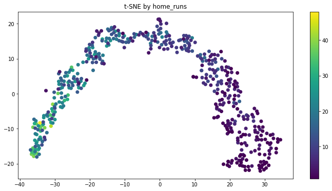


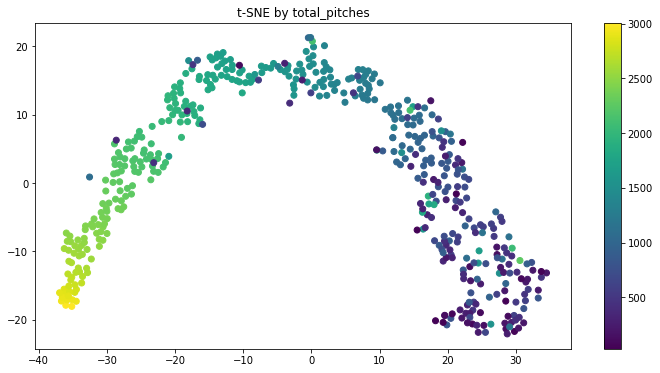


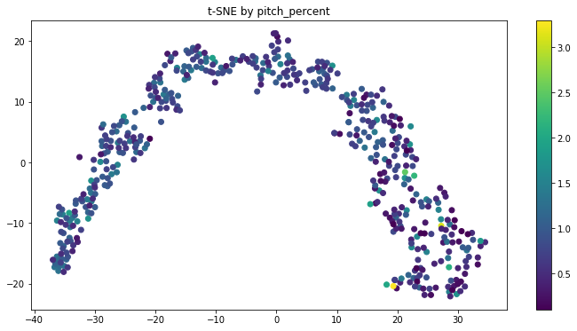


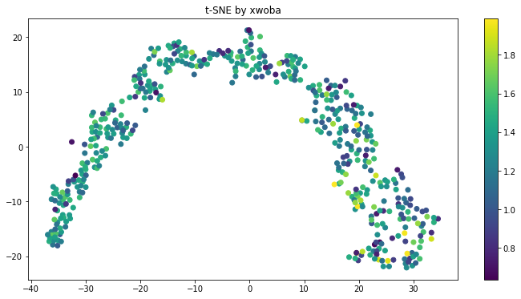


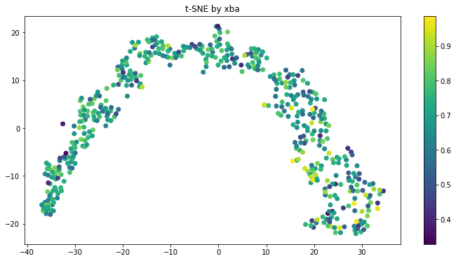


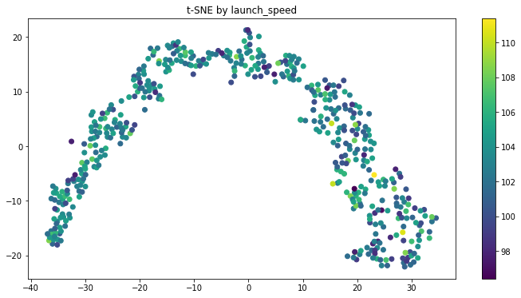


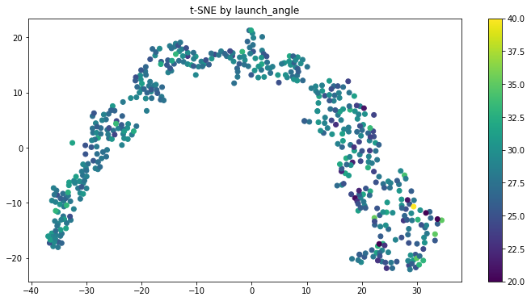


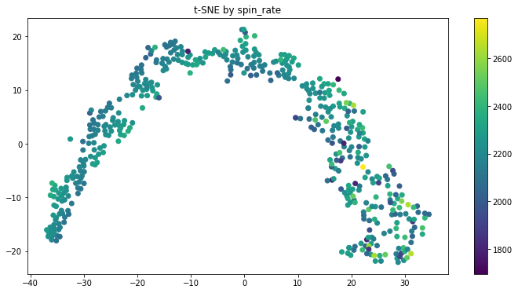


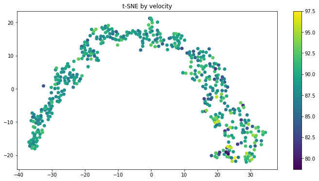


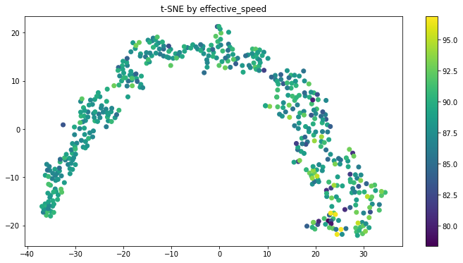


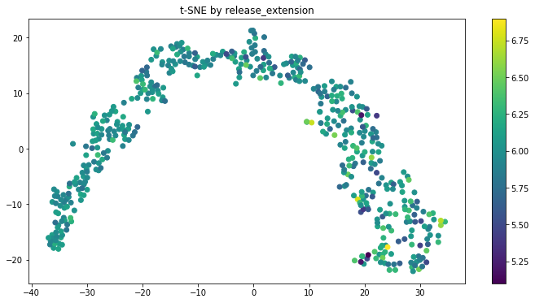

